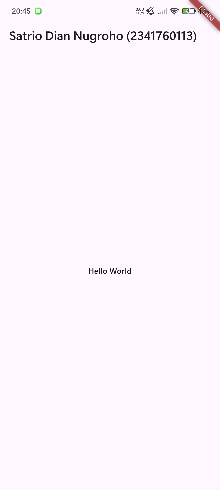

# Layouting on Flutter

Creating the initial structure for the layout

Adding column widgets, text (while adjusting padding and color), and icons (while adjusting size and color)

Create a private method named buildButtonColumn() to build a button column containing icons and text. This method accepts color, icon, and text parameters so that it can be used repeatedly with the same appearance.

Create a textSection variable containing text in a Container with padding on all sides. Use softWrap: true so that the text adjusts to the width of the screen before moving to the next line.

Create a Flutter project named shopping with a structured folder containing the files home_page.dart, item_page.dart, and item.dart for the data model. Use InkWell on the ListView item on the HomePage so that it can move to the ItemPage when pressed.

